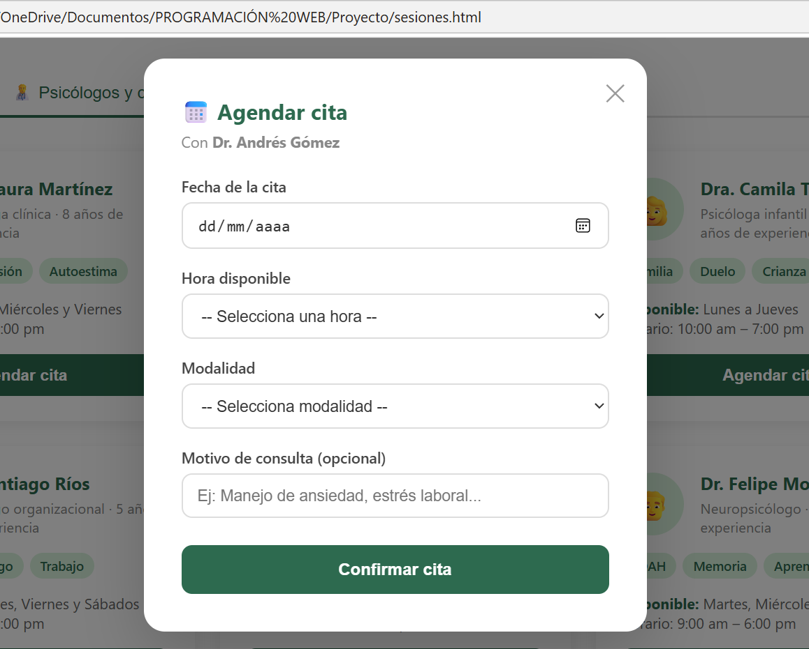

# Âme - Plataforma de Bienestar Emocional

## Integrantes
- Vanessa Ospina Ibarra — 202229286013
- Salomé Caicedo — 1025644894

## Descripción
Aplicación web de bienestar emocional con API REST para gestión de citas psicológicas, construida con Node.js y Express.

## Instrucciones para correr el proyecto

### 1. Clonar el repositorio
```bash
git clone https://github.com/Salo140/Proyecto.git
cd Proyecto
```

### 2. Instalar dependencias
```bash
npm install
```

### 3. Iniciar el servidor
```bash
npm run dev
```

### 4. Abrir en el navegador
- **Gestión de citas (actividad evaluativa):** http://localhost:3000
- **Plataforma Âme:** abrir `index.html` directamente en el navegador

## Endpoints de la API

| Método | Endpoint | Descripción |
|---|---|---|
| GET | /api/citas | Obtener todas las citas |
| GET | /api/citas/:id | Obtener una cita por ID |
| POST | /api/citas | Crear una nueva cita |
| PUT | /api/citas/:id | Actualizar una cita |
| DELETE | /api/citas/:id | Eliminar una cita |

## Captura de pantalla
